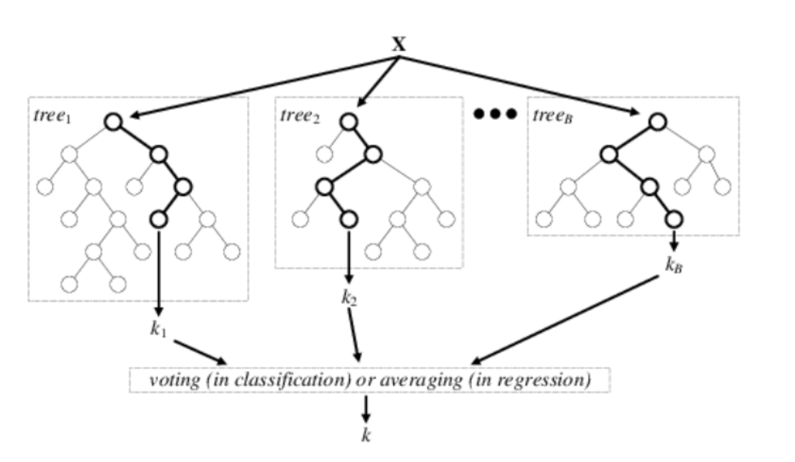
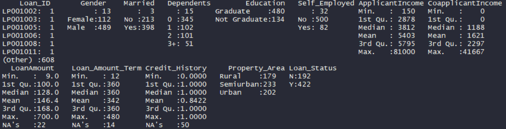
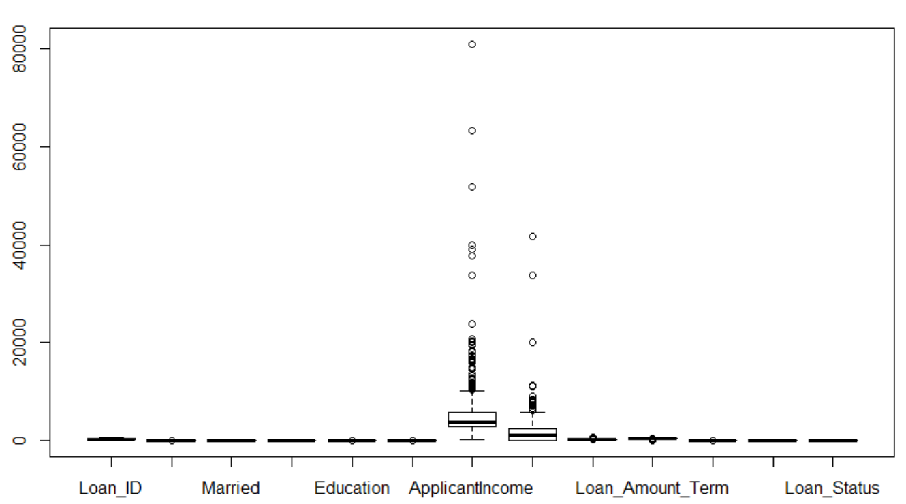

# Random Forest for Predicting Loan Repayment

The project consists of Predicting Loan Repayments using the Random Forest Supervised Learning algorithm. The Random forest uses an ensemble learning method for classification and the bagging technique. The trees in random forests are run in parallel. There is no interaction between these trees while building the trees.

# Getting Started

- Download [https://code.visualstudio.com/] or another alternative source-code editor of your preference
- Download the project on [https://github.com/taxenco/Random-Forest-for-Predicting-Loan-Repayment-R.git].
- Go to your terminal an run the the following command --> git clone https://github.com/taxenco/Random-Forest-for-Predicting-Loan-Repayment-R.git.
- Access to Visual Studio Code or another alternative source-code editor an open the project. Alternatively, you can access the project on through the terminal.
- Download R support for Visual Studio Code

# Prerequisites

- Visual Studio Code or another alternative source-code editor.
- Linux.
- R support for Visual Studio Code.
- Able to read CSV files.

# Objective of the project

This project will implement a Random Forest algorithm on a dataset for classification purposes and predicting whether a customer will pay back the loan or not and also includes an assessment on whether the model has correctly predicted the outcome or not.

# Theory on classification models

Classification [1] is a statistical technique used for predicting, classifying and categorizing to
which of a set of categories a new observation belongs.The classification models[2] need a collection of
records "Training set", which each record contains a set of attributes, one of the attributes is the class.
A model will be built according to the classification technique chosen, and It will find a model for the class attribute
as a function of the values of the other attributes. The model[3] built should assign a class value as accurate as possible to
the unseen records. Finally, the model will be validated in Test set in order to determine the accuracy of the model.

There are different techniques of classification that could be used for predicting, classifying
and categorizing. The most important are as follows[2]:

- Decision Tree-based methods
- Rule-based methods
- Memory-based reasoning
- Neural Networks
- Support Vector Machines

Random Forest is a supervised learning algorithm that can be used for both regression and
classification tasks, and It belongs to the Decision Tree-based methods[2][7]. The Decision
trees [4] are a tree in which each internal "non-leaf" node is labelled with an input feature. The
arcs coming from a node labelled with an input feature are labelled with each of the possible
values of the target or output feature, or the arc leads to a subordinate decision node on a
different input feature. Each leaf of the tree is labelled with a class or a probability distribution
over the classes.

Random Forest[5]operates by constructing a multitude of decision trees at training time and
outputting the class that is the mode of the classes (classification) or mean prediction
(regression) of the individual trees. Random decision forests correct for decision trees' habit of
overfitting to their training set. Note that most of the time Random Forest models have been trained
with the “Bagging” [6] method. The general idea of the bagging method is that a combination of learning models
increases the overall result.

One of the advantages [7] of using the Random Forest model is that the algorithm is simple,
and It uses default hyperparameter, which produces a good prediction, and is easy to
understand. Besides, Random Forest prevents to incur in overfitting since It uses enough trees
to add additional randomness to the model. On the other hand, the main limitation [7] of Random Forest
is that a large number of trees can make the algorithm and ineffective for real-time prediction.

# Data

The data selected is a dataset of customer eligibility for a loan.The dataset used was found on:

- https://datahack.analyticsvidhya.com/contest/practice-problem-loan-prediction-iii/.

The dataset is made up of 614 rows and 13 columns or attributes. The 13 attributes are as follows:

- Loan_ID
- Gender
- Married
- Dependents
- Education
- Self_Employed
- Applicant Income
- Co-Applicant Income
- LoanAmount
- Loan_Amount_Term
- Credit_History
- Property_Area
- Loan_Status --> Target variable

All the variables are categorized as factors but Applicant Income, Loan Amount, Loan Amount
Term and, Credit History which is integers, and Co-applicant Income which is considered
numerical. The dependent variable is Loan status, the rest of the attributes are independent.

Note: Find the original data on /Data/Loan/Dataset.csv

# Data cleaning

The original data is not cleaned and normalized as there are attributes with missing values and others with outliers that distort the information extracted. Therefore cleaning and normalization techniques have been performed before to run the Random Forest algorithm.

The data pre-processing performed has consisted on replacing [3][8] the missing values (NA)
for central tendency measures such a mode and mean, and on subsequent stage outliers’
detections [3][8] and treatment [3][8]. The missing values on the dataset were found on all independent
all attributes, but Applicant Income, Co-applicant Income and Property Area, as you can appreciate on picture above.

Note that the central tendency measures [8] were applied for Its simplicity and because It was
not biasing the information since the number of the missing values on every single attribute
was not high. Besides, it is a simple and powerful technique for cleaning data. However, It
suffers from arbitrarity, and It may lead to data corruption. The central tendency measures
applied to the missing values by attribute is described as follow:

- Gender --> Mode
- Dependents --> Mode
- Self- Employed --> Mode
- Loan Amount --> Mean
- Loan Amount Term --> Mean

The missing values of the Credit History were removed since I considered Credit History a
critical attribute which is better not having the information rather than inferring a value.
It was done this way to prevent biasing results.

A Boxplot Diagram detected the outliers [9] as It shows the picture below:

# Refences

- 1 - https://en.wikipedia.org/wiki/Statistical_classification
- 2 - MSc Data science notes, Salford University. Classification: Decision trees
- 3 - Han, Kamber, and Pei. Data Mining: Concepts and Techniques,3rd Edition, 2012.
- 4 - https://en.wikipedia.org/wiki/Decision_tree_learning
- 5 - https://en.wikipedia.org/wiki/Random_forest
- 6 - https://towardsdatascience.com/the-random-forest-algorithm-d457d499ffcd
- 7 - https://www.researchgate.net/figure/Architecture-of-the-random-forestmodel_fig1_301638643
- 8 - MSc Data science notes, Salford University. Data preparation
- 9 - MSc Data science notes, Salford University. ASDM Workshop: Week1
- 10 - https://www.stat.berkeley.edu/~breiman/Using_random_forests_V3.1.pdf
- 11 - https://cran.r-project.org/web/packages/e1071/e1071.pdf
- 12 - https://data-flair.training/blogs/e1071-in-r/
- 13 - https://www.dataschool.io/simple-guide-to-confusion-matrix-terminology/
- 14 - http://math.furman.edu/~dcs/courses/math47/R/library/randomForest/html/tuneRF.html
- 15 - https://cran.r-project.org/web/packages/reshape2/reshape2.pdf
- 16 - https://cran.r-project.org/web/packages/randomForest/randomForest.pdf
- 17 - https://cran.r-project.org/web/packages/caret/caret.pdf
- 18 - https://cran.r-project.org/web/packages/e1071/e1071.pdf

# Built With

- Linux - Operating system
- R programming language
- CSV files

# Authors

- Carlos Beltran.

# Acknowledgments

The authors would like to thank Salford University.
