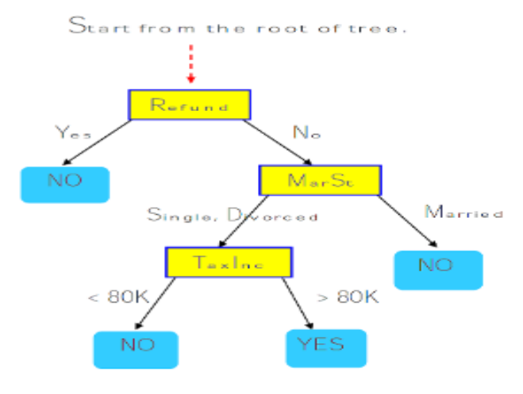
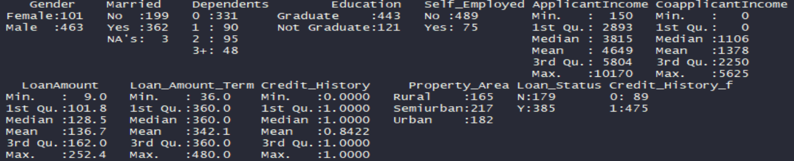
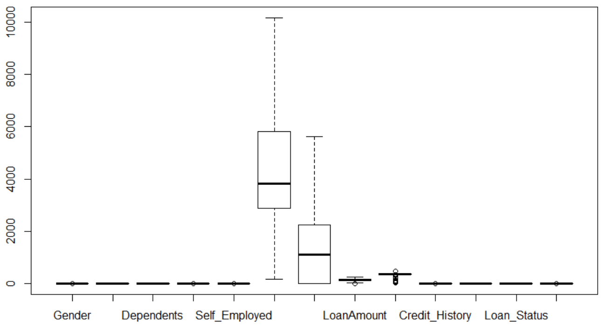
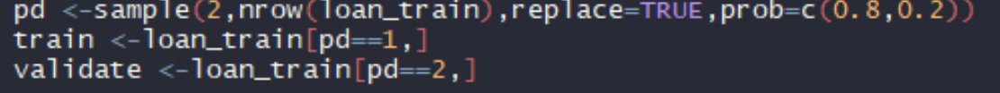
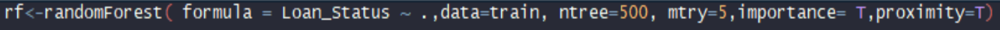
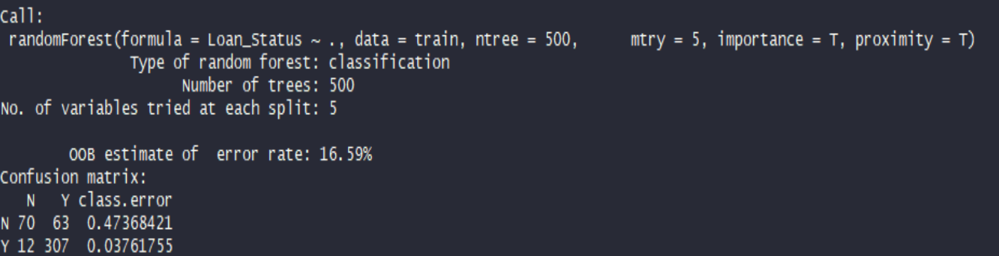
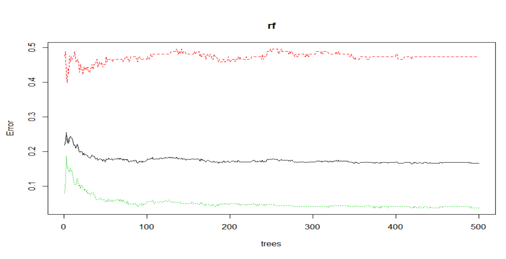
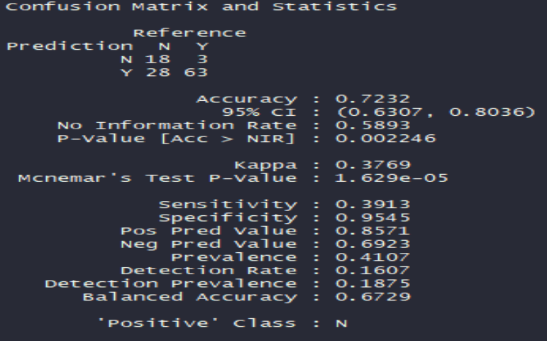
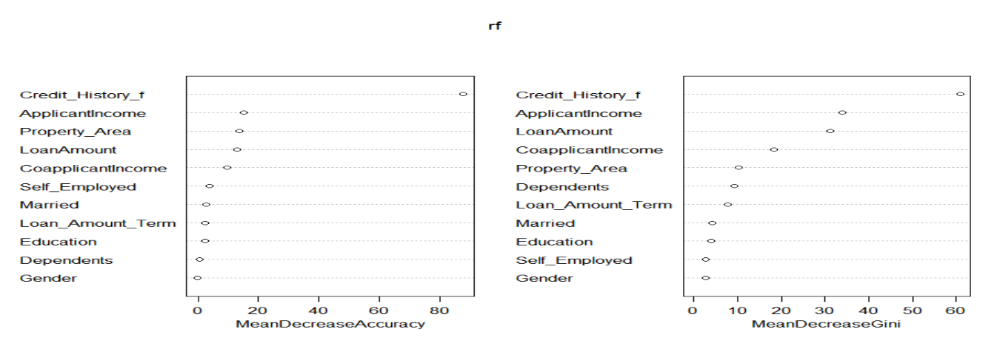
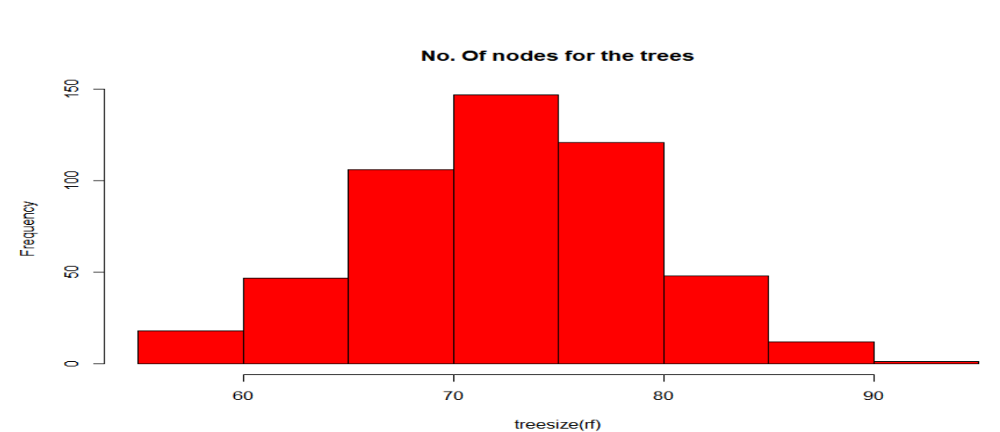

# Random Forest for Predicting Loan Repayment

The project consists of Predicting Loan Repayments using the Random Forest Supervised Learning algorithm. The Random forest uses an ensemble learning method for classification and the bagging technique. The trees in random forests are run in parallel. There is no interaction between these trees while building the trees.

# Getting Started

- Download [https://code.visualstudio.com/] or another alternative source-code editor of your preference
- Download the project on [https://github.com/taxenco/Random-Forest-for-Predicting-Loan-Repayment-R.git].
- Go to your terminal an run the the following command --> git clone https://github.com/taxenco/Random-Forest-for-Predicting-Loan-Repayment-R.git.
- Access to Visual Studio Code or another alternative source-code editor an open the project. Alternatively, you can access the project on through the terminal.
- Download R support for Visual Studio Code

# Prerequisites

- Visual Studio Code or another alternative source-code editor.
- Linux.
- R support for Visual Studio Code.
- Package ‘randomForest’ [10]
- Package ‘e1071’[11]
- Able to read CSV files.

# Objective of the project

This project will implement a Random Forest algorithm on a dataset for classification purposes and predicting whether a customer will pay back the loan or not and also includes an assessment on whether the model has correctly predicted the outcome or not.

# Theory on classification models

Classification [1] is a statistical technique used for predicting, classifying and categorizing to
which of a set of categories a new observation belongs.The classification models[2] need a collection of
records "Training set", which each record contains a set of attributes, one of the attributes is the class.
A model will be built according to the classification technique chosen, and It will find a model for the class attribute
as a function of the values of the other attributes. The model[3] built should assign a class value as accurate as possible to
the unseen records. Finally, the model will be validated in Test set in order to determine the accuracy of the model.

There are different techniques of classification that could be used for predicting, classifying
and categorizing. The most important are as follows[2]:

- Decision Tree-based methods
- Rule-based methods
- Memory-based reasoning
- Neural Networks
- Support Vector Machines

Random Forest is a supervised learning algorithm that can be used for both regression and
classification tasks, and It belongs to the Decision Tree-based methods[2][7]. The Decision
trees [4] are a tree in which each internal "non-leaf" node is labelled with an input feature. The
arcs coming from a node labelled with an input feature are labelled with each of the possible
values of the target or output feature, or the arc leads to a subordinate decision node on a
different input feature. Each leaf of the tree is labelled with a class or a probability distribution
over the classes.

Random Forest[5]operates by constructing a multitude of decision trees at training time and
outputting the class that is the mode of the classes (classification) or mean prediction
(regression) of the individual trees. Random decision forests correct for decision trees' habit of
overfitting to their training set. Note that most of the time Random Forest models have been trained
with the “Bagging” [6] method. The general idea of the bagging method is that a combination of learning models
increases the overall result.

One of the advantages [7] of using the Random Forest model is that the algorithm is simple,
and It uses default hyperparameter, which produces a good prediction, and is easy to
understand. Besides, Random Forest prevents to incur in overfitting since It uses enough trees
to add additional randomness to the model. On the other hand, the main limitation [7] of Random Forest
is that a large number of trees can make the algorithm and ineffective for real-time prediction.

# Data

The data selected is a dataset of customer eligibility for a loan.The dataset used was found on:

- https://datahack.analyticsvidhya.com/contest/practice-problem-loan-prediction-iii/.

The dataset is made up of 614 rows and 13 columns or attributes. The 13 attributes are as follows:

- Loan_ID
- Gender
- Married
- Dependents
- Education
- Self_Employed
- Applicant Income
- Co-Applicant Income
- LoanAmount
- Loan_Amount_Term
- Credit_History
- Property_Area
- Loan_Status --> Target variable

All the variables are categorized as factors but Applicant Income, Loan Amount, Loan Amount
Term and, Credit History which is integers, and Co-applicant Income which is considered
numerical. The dependent variable is Loan status, the rest of the attributes are independent.

Note: Find the original data on /Data/Loan/Dataset.csv

# Data cleaning

The original data is not cleaned and normalized as there are attributes with missing values and others with outliers that distort the information extracted. Therefore cleaning and normalization techniques have been performed before to run the Random Forest algorithm.

The data pre-processing performed has consisted on replacing [3][8] the missing values (NA)
for central tendency measures such a mode and mean, and on subsequent stage outliers’
detections [3][8] and treatment [3][8]. The missing values on the dataset were found on all independent
all attributes, but Applicant Income, Co-applicant Income and Property Area, as you can appreciate on picture above.

Note that the central tendency measures [8] were applied for Its simplicity and because It was
not biasing the information since the number of the missing values on every single attribute
was not high. Besides, it is a simple and powerful technique for cleaning data. However, It
suffers from arbitrarity, and It may lead to data corruption. The central tendency measures
applied to the missing values by attribute is described as follow:

- Gender --> Mode
- Dependents --> Mode
- Self- Employed --> Mode
- Loan Amount --> Mean
- Loan Amount Term --> Mean

The missing values of the Credit History were removed since I considered Credit History a
critical attribute which is better not having the information rather than inferring a value.
It was done this way to prevent biasing results.

A Boxplot Diagram detected the outliers [9] as It shows the picture below:

All the data that was above of the maximum was replaced by the value of the maximum value
of the boxplot. It has been made in order to smooth the data and prevent the data to be skewed
for the outliers.

Please find the summary and the boxplot diagram of the training dataset post-processing as per
below:

# Performing classification Random Forest

In this section will perform a classification model using Random Forest one of the
Decision Tree-based methods. The method aims to decorrelate the several trees which are
generated by the different bootstrapped samples of the training dataset. It reduces the variance
and of the trees by averaging them, improve the performance on the test dataset and avoid
overfitting.

In order to perform such model I have utilized two packages ‘randomForest’ [10] and ‘e1071’[11].
Package ‘randomForest’ allows to use Random forest algorithm to train the model to be able
to validate with the test dataset, while Package ‘e1071’ allows to train support vector machine
(SVM), predictions from the model, as well as decision values from the binary classifiers Using
this method obtains predictions from the model, decision values from the binary classifiers,
data visualization and perform a grid research over specified parameter ranges.

A dataset partition has been performed, which the training set was made of 80 % of the data,
and the test set was made of 20 %. The % has been chosen arbitrary but taking into
consideration that over half of the data needed to be on the training side for the model to allow
the model to be as trained as possible but leaving enough data to test the trained model.

The Random Forest was applied by using the in-built function RandomForest()[10]. Parameter
formula request of the target attribute which is Loan_Status and the independent attributes
which are Gender, Married, Dependents, Education, Employed, Applicant, Co-applicant
Income, Loan Amount Term, Credit History, and Property Area expressed by ‘~.’ Parameter
data stands for training set, Ntree for number of trees, Mtry for number of variables randomly
sampled as candidates at each split, importance for predictor assessment and proximity for the
calculation of proximity of the rows.

Important: this project will use a black-box approach making use of other’s packages to analyse the information.
The black-box approach has been chosen for its simplicity but needs to be noted that this approach entails a
great peril of not understanding what happens within the function and end up with wrong results.

The results of the trained Random Forest model are an out of bag error of 16.59%, which means
that 16.59 % of the classifications made by the model are wrong. 16% is a pretty good number
since for many industry projects over 25% Out-of-bag error (OOB) would be considered not
good enough. The confusion matrix shows a different picture. The True are well predicted but with a 0.037
class error, however, the negatives are poorly assessed, and the class error is at 0.473.

On the figure below are drawn three lines; Red line that represent YES class error, Green line that
represents NO class error and Black line that represents OOB estimate error rate. It illustrates
the rate of the three error regarding the number of trees used in the model.
We see from figure below that the errors achieve their highest value around the tree number 10
and from the to the tree number 100 the values decrease progressively. From tree number 100
onwards the value does not change significantly.

Once the model has been trained, it needs to be tested with data that It has not been seen yet.
The model trained shows a result [13] of its performance on the test a bit poor with an Accuracy
of 0.72 which means that the only 72% of the results were predicted correctly. The confidence
interval of 95 % the model explains between a 63% and 80 % of the data on the test set. The
reason why the model performs poorly is explained by its Sensitivity which is at 39% and
means that the model only predicts correctly YES 39% of the times, while the Specificity is at
0.95 that means that No is predicted correctly 95% of the time.

Another important information that we can find on the model is the importance of the variable
and the number of the nodes for the tree.
In figure 17, Mean Decrease accuracy shows that the most critical variable is credit History
accounting over 80% of explanation of the model and followed by a significant difference by
applicants’ income with around 20 %. The Mean decreases Gini also show that credit history
is the most significant variable with over 60 % of significance, while gender is the least
important.

In figure below it shows the histogram of Number of nodes for the trees show that most common number
of nodes in tree were between 70 and 75.

Important: this project will use a black-box approach making use of other’s packages to analyse the information.
The black-box approach has been chosen for its simplicity but needs to be noted that this approach entails a
great peril of not understanding what happens within the function and end up with wrong results.

# Refences

- 1 - https://en.wikipedia.org/wiki/Statistical_classification
- 2 - MSc Data science notes, Salford University. Classification: Decision trees
- 3 - Han, Kamber, and Pei. Data Mining: Concepts and Techniques,3rd Edition, 2012.
- 4 - https://en.wikipedia.org/wiki/Decision_tree_learning
- 5 - https://en.wikipedia.org/wiki/Random_forest
- 6 - https://towardsdatascience.com/the-random-forest-algorithm-d457d499ffcd
- 7 - https://www.researchgate.net/figure/Architecture-of-the-random-forestmodel_fig1_301638643
- 8 - MSc Data science notes, Salford University. Data preparation
- 9 - MSc Data science notes, Salford University. ASDM Workshop: Week1
- 10 - https://www.stat.berkeley.edu/~breiman/Using_random_forests_V3.1.pdf
- 11 - https://cran.r-project.org/web/packages/e1071/e1071.pdf
- 12 - https://data-flair.training/blogs/e1071-in-r/
- 13 - https://www.dataschool.io/simple-guide-to-confusion-matrix-terminology/
- 14 - http://math.furman.edu/~dcs/courses/math47/R/library/randomForest/html/tuneRF.html
- 15 - https://cran.r-project.org/web/packages/reshape2/reshape2.pdf
- 16 - https://cran.r-project.org/web/packages/randomForest/randomForest.pdf
- 17 - https://cran.r-project.org/web/packages/caret/caret.pdf
- 18 - https://cran.r-project.org/web/packages/e1071/e1071.pdf

# Built With

- Linux - Operating system
- R programming language
- ‘randomForest’ [10]
- ‘e1071’[11]
- CSV files

# Authors

- Carlos Beltran.

# Acknowledgments

The authors would like to thank Salford University.
